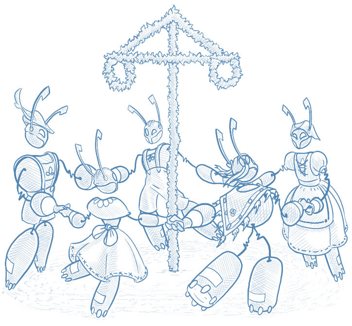

# Proto.Cluster

<small>[Homage to Proto.Actors Swedish roots, Swedish midsummer ring dance - Connected Cluster Actors]</small>

## Virtual Actors, aka. Grains

Proto.Cluster leverages the _"Virtual Actor Model"_, which was pioneered by Microsoft Orleans.
Unlike the traditional Actor Model used in Erlang or Akka, where developers must care about actor lifecycles, placement and failures.
The virtual actor model instead focus on ease of use, high availability where most of the complexity have been abstracted away from the developer.

> The Microsoft Orleans website describes this as _A straightforward approach to building distributed, high-scale applications in .NET_.

**Proto.Actor** combines this way of clustering, with the traditional actor model to combine the best of both worlds.
This allows us to create huge clusters of stateful services where the virtual actors acts as entry points which in turn can contain entire graphs of local actors.

This offers us a unique way to optimize for data locality, while still offering ease of use at scale.

Just like everything else in Proto.Actor where we have re-used proven technologies such as Protobuf and gRPC, we do the same for clustering, we do not reinvent the wheel and create our own cluster mechanics.
Instead, we leverage proven technologies such as Consul, ETCD or Kubernetes to power our Cluster member management.

The short version of what virtual actors are, is that they are abstractions on top of plain actors.
They are spawned _somewhere_ in your cluster, and their lifecycle is managed by the cluster instead of you.

This means that you as a developer, don't have to care or know if the actor already exists or where it exists.
You address it using its identity and kind and the cluster does the rest for you.

## Communicate with Virtual Actors

Virtual actors require request-response based messaging, this is to ensure that the message was delivered and/or that the actor was properly activated.

You do this using `cluster.RequestAsync("MyActor123", "SomeKind", someMessage, cancellationToken)` in .NET, and `cluster.call("MyActor123", "SomeKind", someMessage)` using Go.

This allows Proto.Actor to re-try getting the PID by calling the actor until it succeeds.
