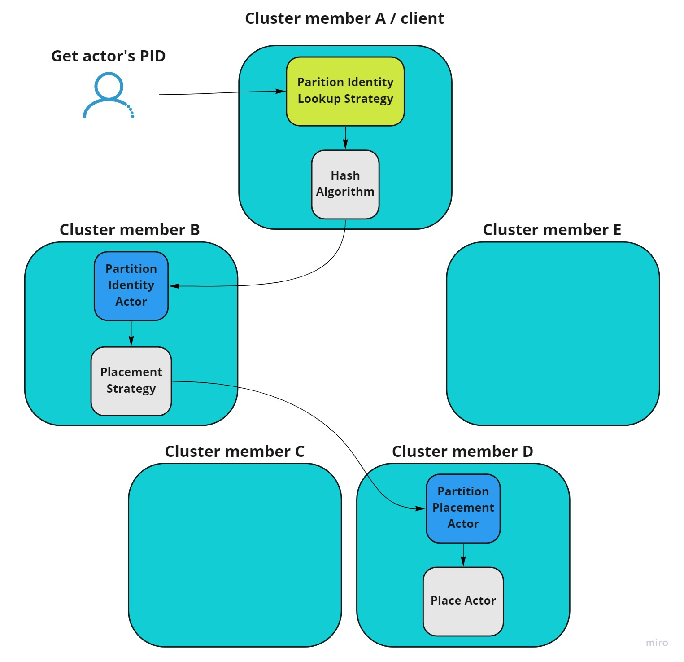

# Partition Identity Lookup

The main feature of this strategy is to split responisibility of owning actor's identity from responsibility of placing it in some member. So in general, one cluster member is responsible to keep actor's identity and another to spawn in the cluster.

Partition Identity Lookup can work in 4 modes. They control how the cluster is behaving during rebalance (when members are going up and down). Rebalance is needed not not leave any actor orphaned (running actor that can't receive any message). It also prevents before having two instances of the same actor in the cluster.

Rebalance is triggered by cluster topology change but it doesn't start until all members in a cluster will reach topology consensus. After reaching topology consensus the rebalance is starting.

* Pull, Send: Full - identity owner pulls the full topology structure from placement actor
* Pull, Send: Delta (Experimental) - identity owner pulls only information about actors that were affected by topology change from placement actor
* Push, Send: Full (Experimental) - placement actor pushes full topology structure to identity owners
* Push, Send: Delta (Experimental) - placement actor pushes only information about actors that were affected by topology change to identity owners

## Mode Pull, Send Full rebalance

