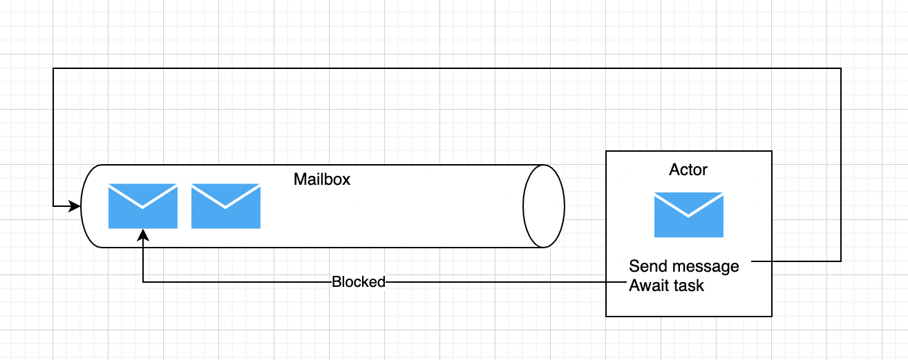

# Dealing with deadlocks

It's entirely possible to create a deadlock by awaiting actor-to-actor or actor-to-self communication. You should try to identify situations where the actor awaiting a request to complete might receive messages triggered by the awaited request.

## Actor-to-self deadlock

One situation where a deadlock may occur is when actor initiates requests to itself and awaits the result. In this case the request message cannot be processed, since the processing is blocked by awaiting.



Requesting to self in order to get some result back is rarely a good idea. In most cases accessing the actor's state directly is a better solution.

### PoisonAsync

A common case of requesting to self and awaiting is a `PoisonAsync` call inside of the actor receive method.

```csharp
var props = Props.FromFunc(async context =>
{
    if (context.Message is Die)
        await context.PoisonAsync(context.Self); // deadlock!
});

var pid = system.Root.Spawn(props);
system.Root.Send(pid, new Die());

record Die;
```

By awaiting `PoisonAsync`, the actor sends `PoisonPill` message into own mailbox then awaits for it to be process. However the message cannot be processed, because the actor is stuck at awaiting. `PoisonAsync` works well when called from outside the actor that is supposed to be shut down. If you want to poison the actor from its own receive method, use `Poison` instead.

## Actor-to-actor deadlock

It's also possible to run into a deadlock when multiple actors are communicating and the flow of messages creates a cycle.

```mermaid
flowchart LR;

    Actor1(Actor 1)
    Actor2(Actor 2)
    Actor3(Actor 3)

    Actor1 --request and await--> Actor2
    Actor2 --request and await--> Actor3
    Actor3 --request and await--> Actor1

```

When Actor 1 is stuck waiting for Actor2 response, it cannot respond to the request from Actor 3. To prevent a deadlock in such case, do not await the request in Actor 1, but instead use [Reentrancy](reenter.md). In particular, the `RequestReenter` method might come in handy.

```csharp
context.RequestReenter<Response>(pid, new Request(), task =>
{
    // the callback runs within actor's concurrency control
    if (task.IsCompletedSuccessfully)
        Console.WriteLine($"Received response {task.Result}");
    else
        Console.WriteLine("Request error");
    return Task.CompletedTask;
    
}, CancellationTokens.FromSeconds(10));
```