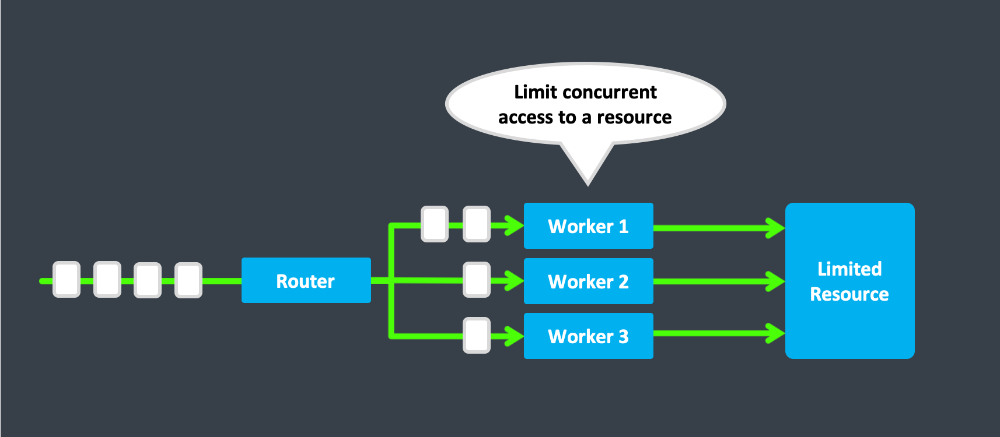

# Limit Concurrency

In some scenarios, it can be useful to be able to limit the number of parallel interactions with some resource.

e.g. there might be some 3rd party service which cannot handle more than X simultaneous requests for whatever reasons, be it technical or legal.

In those cases, you can use a round-robin router to address this.



As seen in the image above, we use a round-robin router to forward messages to, in this case, three worker actors.
These worker actors can then interact with the limited resource.

Because actors process one message at a time, we can guarantee that there will never be more than (in this case) three parallel requests to the limited resource at any given point in time.

# Limit Concurrency using Routers

In this post we will explore how we can use the actor model and routers in Proto.Actor to limit concurrency.
That is, we want to ensure that no more than X concurrent workers are working at the same time.
This can be useful when working with some form of expensive or limited resource, or when you want to scale up and maximize CPU core utilization.


First, let's define a struct that will represent some form of work:
```go
type workItem struct{ i int }
```

In this case, the work-item only carries an `int`, but this can of-course be replaced with something more meaningful.

Now let's define our worker function, we do this by defining a function receiving an `actor.Context` object.
The Context in this case is the context of your actor. that is, it contains the current message, children, and other elements of the actor.

```go
func doWork(ctx actor.Context) {
	if msg, ok := ctx.Message().(*workItem); ok {
		//do work
	}
}
```

As seen above, we have to cast the current message into a `*workItem` pointer.
Go lacks generics and an actor can handle many different message types, this is why messages in Proto.Actor are of type `interface{}`.
(Proto.Actor also work with typed "Grains", more on that in another post)

Once we have received a message of the correct type, we can now perform some sort of work.
The type of work you want to perform can be anything, in this example we will settle for a simple log statement:

```go
func doWork(ctx actor.Context) {
	if msg, ok := ctx.Message().(*workItem); ok {
		log.Printf("%v got message %d", ctx.Self(), msg.i)
	}
}
```

## Creating an actor
Now we need to create an actor and pass some work to this actor:

```go
func main() {
	props := actor.FromFunc(doWork)
	pid := actor.Spawn(props)
	for i := 0; i < 1000; i++ {
		pid.Tell(&workItem{i})
	}
	console.ReadLine()
}
```

We start by calling `actor.FromFunc` to define *how* the actor should be created, in this case, we simply say that we want to create a stateless actor from a function.
Then we call `actor.Spawn` to creates an instance of the actor, this is similar to the `new` function in Go.
The `actor.PID` returned by `Spawn` is an identifier for the actor, and can be used to enqueue messages to the actors mailbox,
We do this by calling `pid.Tell(message)`.

Now we can send messages asynchrounusly to our actor, and the actor can process the messages one by one.

But what if we want to limit concurrency to any other number than 1?

One approach would be to create a slice and then spawn multiple actors from the same props, and then manually round-robin over those actors and send them each a message.
This would result in x actors each pulling one message at a time from their own unique mailbox.
There is however an easier way to do this.
Proto.Actor has support for "Routers".
"Routers" are special actors that do exactly this.

## Working with Routers

What we want in this specific case is a *"Round-robin pool"*, that is, we want a pool of actors, where the workload is sent in a round-robin manner to the workers.
We can do this by altering the above code to this:

```go
const maxConcurrency = 5

func main() {
	props := router.NewRoundRobinPool(maxConcurrency).WithFunc(doWork)
	pid := actor.Spawn(props)
	for i := 0; i < 1000; i++ {
		pid.Tell(&workItem{i})
	}
	console.ReadLine()
}
```

You can see how we replaced the previous `actor.FromFunc` with `router.NewRoundRobinPool`.
This means that we now create a `Props` that will create a router with a round-robin strategy, and also spin up 5 workers, each using the `doWork` message handler.
And this is it, now you can limit concurrency to a fixed number of workers, in our case `5`.
And whatever work you send to the router PID, is now guaranteed to only execute at a maximum concurrency level of 5.

There are of-course other strategies and use-cases for routers, but more on that in my next post.