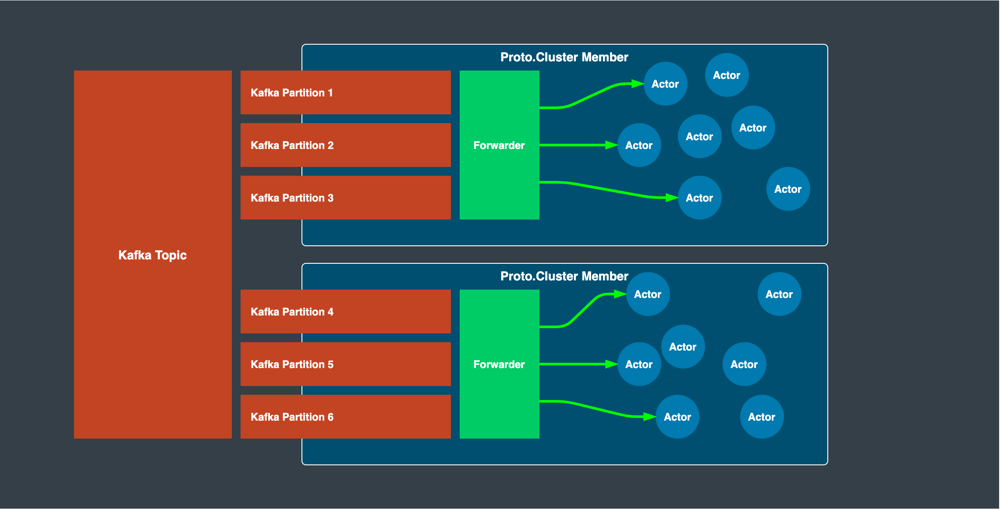
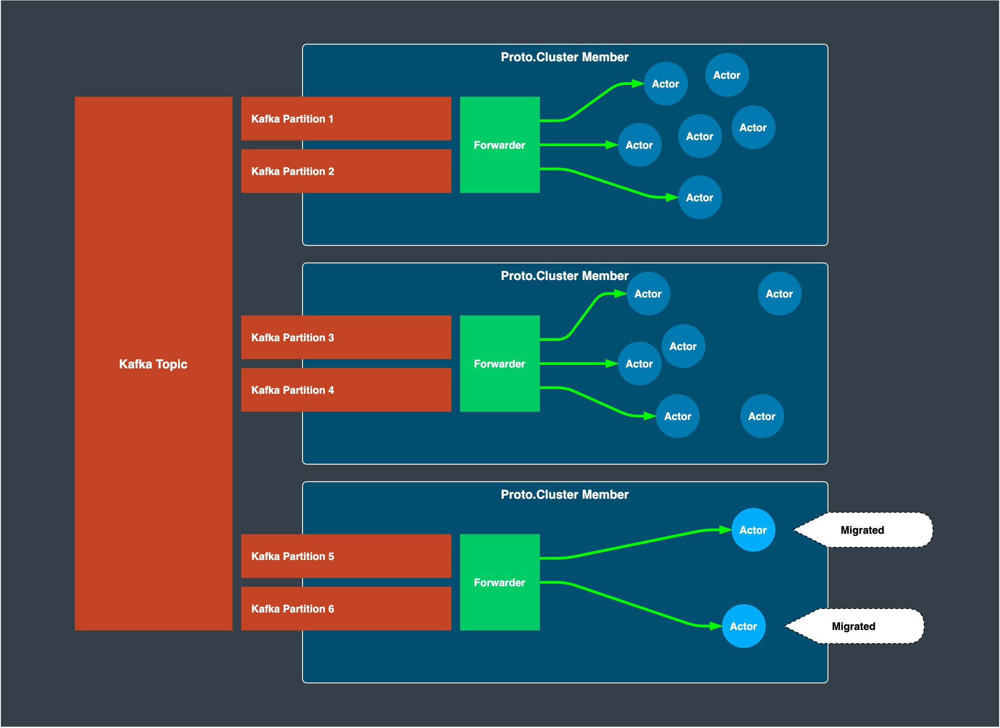

# Local Affinity

Local Affinity placement enables us to place virtual actors, in locality to some other resource.
In this example we place the virtual actors close to a Apache Kafka consumer, the actors on the same node will only be actors that consume messages from the partitions of this specific Kafka consumer.

Incase there is a scale up or down scenario, some of these actors will now be on the original node where they first spawned.
This means that the communication from the Proto.Kafka forwarder will have to do remote communication with those actors.

Here is where gradual migration comes into play.
The actors will check if the sender of a message is on a remote node, and if so, ad a random, userdefined interval, start to shut themselves down and eventually respawn on the correct node.

Once all actors have migrated, we are now back at having fully local affinity from Kafka partitions to actors consuming the messages from those partitions.

We now get the best of both worlds, robust fault tolerant systems, with the performance of inprocess communication.