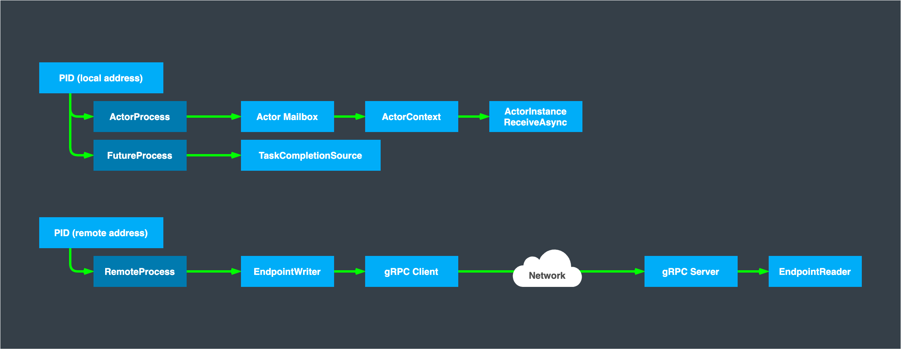

# PID

When you spawn an actor you don't get a direct reference to it. Instead, you get a `PID` (short for process ID) which is a serializable identifier that is used to send messages to the actor's mailbox. A benefit of this is that the `PID` can easily and cheaply be serialized and sent over the wire, allowing for actors to communicate remotely.

## Communicating with PIDs

There are two main methods of communicating with a PID.

### Send

`Send` is a non-blocking, fire-and-forget method for sending a message to an actor. The message will be enqueued in the receiving actor's mailbox and will eventually be processed, assuming the actor isn't stopped. Tell is also the most performant way of communicating with actors, so it is the preferred default unless your use case requires a request/reply pattern of communication.

### Request

`Request` is very similar to `Send`, but it also includes the sender PID so that the receiving actor can send a reply. It should only be used when you require request/reply communication between two actors, because it creates an extra allocation for each message in order to include the sender PID. For remote communication, it will also increase the payload that is serialized and deserialized.

`RequestAsync<T>` is identical to `Request` but it returns an awaitable `Task` that will complete when the actor has sent a reply of type `T`. It should only be used when you require a synchronous mode of communication.

## Architecture of PIDs

You can think of the PID as the phone number to an actor, and the process as the underlying infrastructure used to reach the target.

There are three built-in Process types in Proto.Actor.

`LocalProcess`, `RemoteProcess` and `FutureProcess`.

